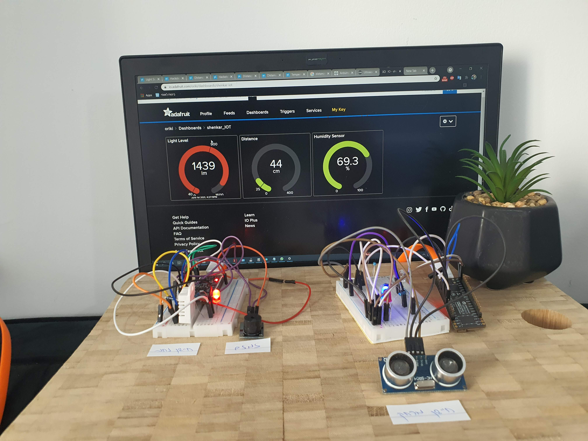

# Smart Garden Project
### Check the light and the humiditly garden

#### The Project is about:
- Trun on blue light when there is enough brightness. Red light otherwese.
- Turn on red light when there isnt enough humiditly.
- Trun on buzzer when somethin is too close to our plant.

#### Hardware components
• 2 x ESP32-PICO
• 4 x LED – 2 x red, blue, white
• 2 x Breadboard
• Light Sensor
• Speaker
• Ultrasonic sensor
• Moister sensor
• USB cable
• 2 x Resistor 210Ω
• 4 x Resistor 10KΩ

[video]("ttps://photos.app.goo.gl/gBPTGnfGFqJaRyms9)
[presentation](Smart%20Garden.pdf)

